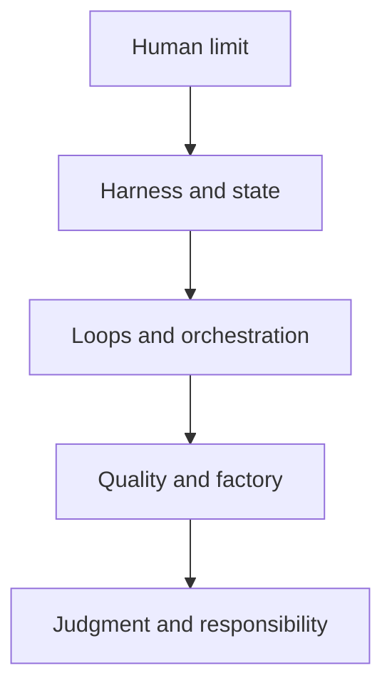
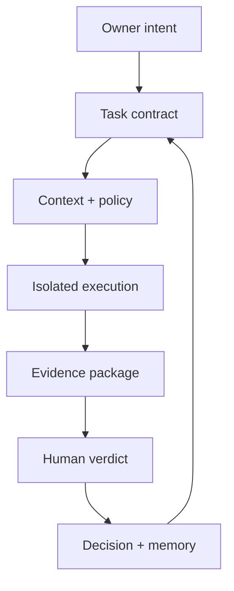

# Addy Osmani canon for Amarelo agent engineering

This is retrievable external engineering context for Amarelo's harness, synthesized in the reading order specified by the owner. The capture date records provenance; the source material itself is not assigned an Amarelo content version.

> Continuity rule: Addy Osmani is a high-weight reference for **harness engineering, agent architecture, loop engineering, orchestration, autonomy, review, and AI-assisted software quality**. He does not hold authority in Amarelo over health, clinical care, diagnosis, treatment, patient privacy, or product decisions that go beyond AI engineering.

## 1. Authority contract

This canon does not make Addy an absolute source of truth. It defines a specialized and subordinate authority.

### 1.1 Positive scope

Addy's ideas should influence:

- harness architecture and context surfaces;
- the design of agents, subagents, skills, tools, hooks, and permissions;
- task contracts, autonomy levels, and stop conditions;
- durable state, resumption, handoff, and recovery for long-running agents;
- loop engineering, queues, isolation, and backpressure;
- evidence, review, quality, observability, and accountability;
- preservation of human understanding, learning, taste, and judgment.

### 1.2 Negative scope

Addy's ideas should not govern:

- health, medicine, therapy, diagnosis, clinical risk, or care;
- product AI behavior toward the person receiving support;
- consent, personal memory, and privacy beyond what has already been decided by the owner and the Amarelo canon;
- business strategy, product positioning, or domain decisions without explicit owner approval;
- automatic selection of a framework, provider, or vendor.

### 1.3 Precedence

When sources conflict, use this order:

1. the owner's active instruction;
2. Amarelo's current canonical decisions and decision record;
3. the aligned canonical bootstrap;
4. the owner's most recent explicit decision;
5. the implementation observed in the repository, as fact rather than intent;
6. current ADRs, specifications, rules, and prompts;
7. this Addy-inspired engineering canon;
8. historical materials;
9. agent inference.

Therefore, Addy is a strong adviser, not a legislator. Amarelo's product principle remains: **the person speaks; AI organizes; the person decides**. Product AI and engineering AI remain conceptually distinct systems.

### 1.4 Current testing policy

The owner has decided that the current phase will not include unit tests, integration tests, end-to-end tests, smoke tests, Playwright, or Cypress. Addy's articles strongly advocate tests and evals, but the invariant we should import now is more abstract: **an agent cannot be the only witness that its own work is correct**.

At this stage, admissible evidence includes:

- deterministic dependency installation;
- TypeScript/typecheck;
- lint and formatting, when already configured;
- production build;
- `start` and `dev` startup;
- readiness verification and absence of observable compilation/runtime errors;
- manual inspection of diffs and behavior;
- risks, gaps, and uncertainties stated explicitly.

Automated tests and evals remain future gates and are deliberately deferred. This canon does not silently reintroduce them.

## 2. How the research was conducted

All 20 articles were read in full, in the provided order. In addition to the text, the following were extracted:

- titles, dates, and subtitles;
- 67 images, diagrams, and their captions/alt text;
- 229 link occurrences, corresponding to 159 unique URLs;
- academic references, official documentation, engineering reports, vendor benchmarks, surveys, and social commentary.

Structurally important diagrams were visually inspected in groups: harness anatomy, the new SDLC, autonomy, the outer loop, the software factory, quality, practical loops, and the relocation of human judgment.

The references were not given equal weight. The following classification was used:

| Class | Example | Use in the canon |
|---|---|---|
| Primary research | arXiv, MIT, METR | Evidence with explicit methodological limits |
| First-party documentation or report | Anthropic, OpenAI, Vercel, Warp | A pattern practiced by one organization, not a universal law |
| Independent practice | Martin Fowler, HumanLayer | Experienced heuristic and comparable architecture |
| Vendor study/benchmark | CodeRabbit, Faros, GitClear, Sonar, GitLab | Market signal with possible conflicts of interest |
| Social post or opinion | X, newsletters, comments | Illustration and hypothesis, never a standalone foundation |
| Addy's own cross-link | Other blog articles | Editorial continuity, not external validation |

This document is a derived synthesis, not a reproduction of the articles. Specific numbers were preserved only when they help evaluate a thesis and are accompanied by their origin or a caveat.

## 3. The editorial story in five acts

Read in sequence, the articles are not a loose collection. They build a thesis in five movements.



### Act I — Capability grows, but the human remains serial

The first articles begin with the core asymmetry: agents increase generation capacity in parallel, but human understanding, reconciliation, and approval do not scale at the same rate. The result is that “more agents” does not automatically mean “more throughput.” It can simply mean a larger queue of work that no one understands.

### Act II — The model is not the system

The focus shifts from the model to the environment that makes it useful. Documentation must be machine-consumable; the harness must provide tools, context, control, persistence, and observation; long-running agents need external state; skills need to be executable workflows loaded on demand.

### Act III — Automation needs loops, not magic prompts

The agent is now understood as an actor inside a recurring system. Work is decomposed, dispatched, isolated, evaluated, fed back, and stopped by explicit conditions. At the same time, the cost of orchestration becomes visible: coordination, review, and reconciliation consume the attention that automation promised to free.

### Act IV — Scale turns loops into a factory and review into the bottleneck

When many loops share queues, gates, deployment, and production signals, we have a factory. A factory can operate “in the dark,” accumulating code no one understands, or “with the lights on,” placing human judgment before generation and at the gates with the greatest consequences. Quality stops being a final inspection and becomes pressure distributed across the system.

### Act V — Human work moves up a level

The conclusion is not that humans disappear. Humans change position: they define intent and limits before the work; decide what counts as evidence; judge novelty, risk, and trade-offs; and own the verdict and consequences. The outer loop is the place of responsibility.

## 4. Chronological reading of the 20 articles

### 4.1 [Your parallel Agent limit](https://addyosmani.com/blog/cognitive-parallel-agents/) — April 7, 2026

**Problem introduced.** The number of agents a person can start grows faster than the number of outputs that person can understand, compare, and review. The operational limit is not only CPU, tokens, or number of sessions; it is cognitive bandwidth.

**Durable ideas.**

- parallel generation and human review are different resources;
- independent, verifiable tasks parallelize better;
- coupled, ambiguous, or architectural work increases reconciliation cost;
- the optimal number of agents is determined by the capacity to absorb their outputs;
- queues without backpressure convert speed into review debt.

**Story development.** The article establishes the human as the system's first bottleneck and prepares the later thesis of the orchestration tax and the outer loop.

**Application to Amarelo.** We should not measure harness success by simultaneous agents. The useful metric is work understood and accepted per unit of owner attention.

### 4.2 [Agentic Engine Optimization (AEO)](https://addyosmani.com/blog/agentic-engine-optimization/) — April 11, 2026

**Problem introduced.** Documentation originally designed for human navigation is increasingly consumed in one or two requests by agents. Structure, freshness, format, and token cost now directly affect execution.

**Durable ideas.**

- documentation is part of the system's interface for agents;
- stable pages, clean Markdown, OpenAPI, `llms.txt`, `AGENTS.md`, and skills reduce ambiguity;
- large content needs indexes, chunking, and progressive disclosure;
- traditional human analytics may not represent agent-mediated consumption;
- version and freshness need to be explicit.

The article draws on a study of HTTP signatures from nine coding agents and six assistants, which observed compressed navigation and distinct access patterns. It is interesting but narrow evidence: one endpoint, specific versions, and three rounds per tool. The research itself states those limitations. See the [AEO paper](https://arxiv.org/html/2604.02544v1).

**Story development.** Before teaching an agent how to work, knowledge must be made readable and retrievable by it.

**Application to Amarelo.** Rules should not be scattered across historical prose. Root context should be short and universal; specialized material should be indexed and retrieved on demand.

### 4.3 [Agent Harness Engineering](https://addyosmani.com/blog/agent-harness-engineering/) — April 19, 2026

**Core thesis.** A useful agent is the model plus the system around it. The harness provides context, control, action, persistence, and observation.

**Components identified.**

- prompts, rules, skills, and memory;
- tools, bash, filesystem, Git, and MCP;
- sandboxing, permissions, hooks, and guardrails;
- compaction, planning, and subagents;
- logs, screenshots, verifiers, and observability;
- recovery, checkpoints, and durable state.

**Ratchet principle.** A real failure should produce a localized harness improvement. But every line of configuration should be “earned”: configuring everything in advance creates noise and reduces capacity. The [HumanLayer](https://www.humanlayer.dev/blog/skill-issue-harness-engineering-for-coding-agents) report reinforces that long or automatically generated agentfiles can hurt results and that too many tools consume the instruction budget. The analysis by [Birgitta Böckeler/Martin Fowler](https://martinfowler.com/articles/harness-engineering.html) adds a useful distinction among maintainability harnesses, architectural fitness, and behavior.

**Story development.** The article provides the fundamental architectural unit for all subsequent texts.

**Application to Amarelo.** `.agents` is not the whole harness. It is one harness surface. Rules, tools, state, isolation, evidence, and recovery are also part of it.

### 4.4 [Long-running Agents](https://addyosmani.com/blog/long-running-agents/) — April 28, 2026

**Problem introduced.** A long conversation is not durable state. Context windows fill up, the model loses coherence, stops early, repeats work, or forgets decisions.

**Recommended pattern.**

- external specification and work plan;
- one small unit per iteration;
- progress and decision files;
- recoverable commits/checkpoints;
- structured handoff across sessions;
- compaction when continuity is sufficient;
- full reset when contaminated or “anxious” context threatens the work;
- independent verification of the result.

Anthropic's experience shows that the optimal design can change between models: one version required full resets; another was able to operate with compaction. Therefore, the invariant is not “always reset,” but **do not rely on implicit session memory**. See the [long-running harness report](https://www.anthropic.com/engineering/harness-design-long-running-apps).

**Application to Amarelo.** Execution state must exist outside the transcript. Project memory and the person's memory also cannot be conflated: raw conversation does not automatically become memory.

### 4.5 [Agent Skills](https://addyosmani.com/blog/agent-skills/) — May 3, 2026

**Core thesis.** A good skill is an actionable operational module, not a long essay.

**Anatomy of a strong skill.**

- clear trigger;
- scope and non-scope;
- required inputs;
- sequence of actions;
- checkpoints and exit criteria;
- failure handling;
- output format;
- resources loaded only when needed.

**Progressive disclosure.** Minimal metadata helps with selection; full instructions enter only after a match; references and scripts appear only at the step that requires them.

**Story development.** Skills turn static knowledge into reusable behavior and bridge the harness and loops.

**Application to Amarelo.** The skill inventory should not be loaded in full on every turn. Skills need task-based selection and boundaries that prevent accidental authority expansion.

### 4.6 [Cognitive Surrender](https://addyosmani.com/blog/cognitive-surrender/) — May 5, 2026

**Core distinction.** Delegating calculation or production is cognitive offloading; accepting a conclusion without preserving the ability to evaluate it is cognitive surrender.

**Risks.**

- verbal fluency can be mistaken for truth;
- user confidence can rise without corresponding evidence;
- the agent can become both author and judge of the same conclusion;
- outsourcing reasoning can weaken future ability to detect failures.

**Proper use.** Ask for assumptions, alternatives, refutation points, confidence level, and evidence. For important decisions, form your own view before seeing the agent's answer.

The article cites still-young research. The MIT study on LLM-assisted writing found lower neural connectivity, recall, and ownership in the LLM group, but it had 54 participants in the first sessions, 18 in the fourth, and a writing task — it does not directly prove the same effect in engineering. See [MIT Media Lab](https://www.media.mit.edu/publications/your-brain-on-chatgpt/).

**Application to Amarelo.** No agent should present an important conclusion as though fluency replaces provenance, uncertainty, and contestability.

### 4.7 [Don’t Outsource the Learning](https://addyosmani.com/blog/dont-outsource-learning/) — May 16, 2026

**Core thesis.** AI can accelerate execution in already-consolidated knowledge and can harm new knowledge acquisition when it removes the attempts that build the mental model.

**Practices.**

- use AI to explain, compare, and question, not merely generate;
- rebuild the solution without looking;
- keep a record of wrong predictions and corrections;
- manually perform part of the tasks that sustain critical judgment;
- ask the agent to challenge the user's understanding, not replace it.

An Anthropic RCT with 52 developers found 17% lower performance on a domain quiz for the AI group; the average time gain was not statistically significant. The study itself highlights a small sample, immediate measurement, and a specific learning task. It also observed that conceptual queries and “generate, then understand” were associated with better retention. See the [study on skill formation](https://www.anthropic.com/research/AI-assistance-coding-skills).

**Application to Amarelo.** The harness can include explanation modes and handoffs that reveal why a change works. That is different from forcing verbosity on every task.

### 4.8 [The Orchestration Tax](https://addyosmani.com/blog/orchestration-tax/) — May 24, 2026

**Core thesis.** Multiple agents do not eliminate human work; they convert part of it into routing, monitoring, comparison, conflict resolution, and review. The human functions like a cognitive GIL.

**Consequences.**

- parallelism helps only when tasks and states are sufficiently independent;
- context-switching cost rises with the number of runs;
- long and heterogeneous outputs are expensive to reconcile;
- a growing queue can hide declining effective throughput;
- more generation capacity requires more filtering capacity and backpressure.

METR's work is useful for measuring task difficulty, but it should not be read as “an agent works autonomously for X hours.” The lab itself defines time horizon as equivalent human duration at a given probability of success and warns that real tasks are more contextual and less easily scored. See the [time-horizon methodology](https://metr.org/time-horizons/).

**Application to Amarelo.** The orchestrator should limit concurrency based on verification capacity and risk, not the technical maximum.

### 4.9 [The Intent Debt](https://addyosmani.com/blog/intent-debt/) — June 5, 2026

**Core thesis.** Code records what exists, but often does not record why it exists, which alternatives were rejected, which limits are deliberate, and what must not change.

**Three-debt model.**

- technical debt in code;
- cognitive debt in people and shared understanding;
- intent debt in missing or degraded externalized knowledge.

The model comes from Margaret-Anne Storey's work and describes intent debt as the absence of rationale, objectives, and constraints needed for humans and agents to safely evolve a system. See the [Triple Debt Model](https://arxiv.org/abs/2603.22106).

**Application to Amarelo.** ADRs, decision records, non-goals, and provenance are part of the executable system. The repository can prove current implementation; by itself, it cannot reconstruct intent.

### 4.10 [Loop Engineering](https://addyosmani.com/blog/loop-engineering/) — June 7, 2026

**Change of unit.** Instead of optimizing only the prompt of one session, design the system that dispatches, informs, constrains, observes, and reruns the agent.

**Loop elements.**

- event, objective, or cadence;
- work selection;
- appropriate context and tools;
- isolated workspace;
- action;
- evaluator;
- feedback into the next iteration;
- stop condition, budget, and escalation;
- external, resumable state.

**Maker/checker separation.** The producing agent has incentives and context that make it a poor evaluator of its own work. An independent checker reduces self-attestation, although it does not eliminate the need for human judgment.

**Application to Amarelo.** A future agent should have an operational contract; “continue until done” is not a contract.

### 4.11 [Agentic Code Review](https://addyosmani.com/blog/agentic-code-review/) — June 15, 2026

**Core thesis.** AI review is a sensor and triage mechanism, not the final verdict. It is good at mechanical patterns, inconsistencies, known risks, and prioritization; it is less reliable for intent, architecture, novelty, and business consequences.

**Depth by risk.** Review depth should scale with blast radius, irreversibility, novelty, and weakness of evidence. Small localized adjustments can use a fast path; public contracts, data, auth, and architecture require deeper inspection.

Research on agent-generated PRs reinforces the asymmetry. One study of 33,707 PRs found 28.3% immediate merges for narrow automation and an expensive review tail; a structural classifier could identify part of that tail, but that does not prove quality — only predictability of effort. See [prediction of review effort](https://arxiv.org/html/2601.00753). Another study of roughly 33,000 PRs found better merge rates in documentation/CI/build and worse rates in performance/fixes; among 600 sampled rejections, 38% received no meaningful human engagement. See [failed agentic PRs](https://arxiv.org/html/2601.15195).

**Application to Amarelo.** A reviewer agent can reduce how much the owner needs to read, but it cannot take over the decision to accept high-impact changes.

### 4.12 [The New Software Lifecycle](https://addyosmani.com/blog/new-sdlc-vibe-coding/) — June 16, 2026

**Core thesis.** Implementation compresses; specification, architecture, and verification become the new bottlenecks. The difference between vibe coding and agentic engineering is not whether AI is used, but how intent and evidence are structured.

**Context architecture.** The article divides context into:

- **static:** universal instructions, fundamental rules, permitted global memory, and guardrails;
- **dynamic:** selected skills, tool results, and documents retrieved for the task.

This separation is an architectural and economic decision: everything static consumes tokens and attention on every turn.

**Caveat.** The total-cost graphs and the visual “model ~10%, harness ~90%” split are explanatory metaphors, not universal measurements. The value lies in the direction of the thesis, not the literal percentage. The related editorial source is the [new SDLC whitepaper](https://www.kaggle.com/whitepaper-the-new-SDLC-with-vibe-coding).

**Application to Amarelo.** Global rules need to be small; specialized rules should be dynamic; changes should begin with intent and end with an evidence package.

### 4.13 [Agentic Autonomy Levels](https://addyosmani.com/blog/agentic-autonomy-levels/) — July 2, 2026

**Conceptual correction.** Autonomy is not a single ladder. There are at least two axes:

- **agency:** how far an agent goes within a task;
- **orchestration:** how many agents operate and who coordinates the fleet.

The article summarizes six operating levels:

| Level | Agent role | Human role |
|---|---|---|
| L0 — Assist | Suggests | Decides and executes every step |
| L1 — Supervised action | Acts with permitted tools | Approves before relevant changes |
| L2 — Scoped delegation | Owns a limited task | Guides, inspects, and accepts |
| L3 — Goal-driven autonomy | Iterates until a measurable condition | Defines contract and handles exceptions |
| L4 — Parallel delegation | Multiple agents in parallel | Routes, reconciles, and reviews the queue |
| L5 — Managed-by-exception | System schedules, delegates, and verifies | Decides exceptions and owns consequences |

**Calibrated autonomy.** The level is a property of the task and harness, not a permanent reputation of the model. It should be determined by risk, reversibility, available evidence, and history on that class of work.

Anthropic's first-party study is consistent with this: experienced users auto-approve more actions, but also interrupt more; supervision moves from step-by-step approval to monitoring and intervention. The research covers only the Anthropic ecosystem and uses classifications partly produced by the model itself. See [measuring agent autonomy](https://www.anthropic.com/research/measuring-agent-autonomy).

**Application to Amarelo.** Each task receives an explicit autonomy level. There is no global “full autonomy” setting.

### 4.14 [The Agent-Era Career](https://addyosmani.com/blog/career-advice-age-of-agents/) — July 6, 2026

**Core thesis.** Professional value shifts from typing and boilerplate toward problem definition, deep mental models, architecture, evidence, and ownership.

**Practices proposed.**

- master at least one system in depth;
- build difficult things without always relying on generation;
- learn to specify and decompose;
- develop the ability to read and debug code produced by others;
- own an entire system surface, not just tasks;
- distinguish apparent speed from real impact.

**Application to Amarelo.** The harness should increase the owner's leverage without removing the understanding required to direct the product.

### 4.15 [Earning taste and judgment](https://addyosmani.com/blog/earning-judgment/) — July 14, 2026

**Core thesis.** Taste is judgment before a reliable metric exists. It is not created by passive exposure to outputs; it comes from reps, comparison, consequences, and feedback.

**How to develop it.**

- compare alternatives before knowing the result;
- make a prediction and then observe the error;
- maintain a “wrong log”;
- study excellent systems and real failures;
- distinguish aesthetic preference from domain constraints;
- do not automate every experience that builds perception.

**Application to Amarelo.** Subjective criteria can be partially translated into rubrics, but the owner remains responsible for the quality bar that does not yet fit into a rubric.

### 4.16 [Own the Outer Loop](https://addyosmani.com/blog/own-the-outer-loop/) — July 15, 2026

**Intermediate synthesis.** Agents execute the inner loop: investigate, implement, test/verify, and report. Engineers own the outer loop: decide what is worth doing, define constraints, interpret evidence, approve, own consequences, and update the system.

**Responsibility vocabulary.**

- **evidence:** the boundary of safe delegation;
- **verdict:** the human decision about what the evidence means;
- **answerability:** who must answer for the result;
- **consequences:** what only people and organizations inherit;
- **alpha:** current advantage over the model;
- **decay:** how quickly that advantage is absorbed;
- **taste/judgment:** capabilities that take longer to become commodities.

**Story development.** The article connects architecture to professional identity: accountability is not the residue left after automation; it is the mechanism that allows automation to scale.

**Application to Amarelo.** Every relevant action should make clear who provides evidence, who decides, and who is accountable. For clinical or sensitive human decisions, Addy does not enter that chain of authority.

### 4.17 [Software Factories, Light and Dark](https://addyosmani.com/blog/software-factories/) — July 20, 2026

**Definition.** A factory is not a smarter agent. It is a repeatable system of many harnessed loops, driven by events and drained through shared gates.

**Flow.** intent → queue → harness → checks/sensors → review → deploy → monitoring → new signals.

**Dark factory.** Maximizes generation, automates approval, and accumulates software no one understands. It is fast until the first expensive failure.

**Lit factory.** Keeps judgment upstream, in design and architecture, and at high-impact gates. It does not require manually reading every line, but it does require strong constraints, legible evidence, and human decisions where they matter.

Production reports converge in this direction. Vercel describes a factory in which risk determines review depth and no merge occurs without human approval. See the [AI SDK software factory](https://vercel.com/blog/building-a-software-factory-for-ai-sdk). OpenAI published Symphony as an orchestration specification with the issue tracker as the control plane, a single scheduling authority, workspaces, retries, reconciliation, and handoff to `Human Review`. See [Symphony](https://openai.com/index/open-source-codex-orchestration-symphony/).

**Application to Amarelo.** Do not build a factory before repeatable, event-driven, verifiable work exists. Harness first; then loops; only then a factory.

### 4.18 [Agentic Code Quality](https://addyosmani.com/blog/agentic-code-quality/) — August 8, 2026

**Core thesis.** Quality cannot depend on the model “remembering to do the right thing.” It must be shaped by constraints and backpressure around the agent.

**Dimensions.**

- correctness;
- security;
- performance;
- accessibility;
- maintainability;
- cost efficiency;
- comprehensibility.

**Autonomy is earned.** Routine changes with strong history and cheap evidence can move up in autonomy. Novelty, high risk, or weak evidence should meet resistance early.

**Application to Amarelo.** In the current phase without tests, available gates should still be deterministic where possible: types, lint, build, startup, and manual review. The absence of a sensor class lowers admissible autonomy; it is not a reason to pretend confidence.

### 4.19 [Practical Loop Engineering](https://addyosmani.com/blog/practical-loop-engineering/) — August 14, 2026

**Operationalization.** A loop has an objective, action, evaluator, feedback, and stop condition. The evaluator is the most important point: without a machine-checkable condition, the task is not ready for recursive autonomy.

**Four forms.**

- turn-based: one interaction;
- goal-based: ends when a condition becomes true;
- time-based: wakes on a cadence while the session exists;
- proactive/scheduled: survives the session and reacts to events or a schedule.

**Concrete patterns.**

- command + verifiable condition + bound;
- maker separated from checker;
- one worktree/workspace per parallel run;
- heartbeat separated from the objective;
- labels as triage and parking rules;
- stop when there is no progress;
- do not aim loops at subjective taste, deep architectural decisions, or irreversible actions without human handoff.

Warp's example shows a simple label taxonomy (`ready-to-implement`, `ready-to-spec`, `needs-info`, `wait-to-implement`) that functions simultaneously as a queue and an automation boundary. See the [automatic triage skill](https://www.warp.dev/blog/how-to-build-a-cloud-software-factory-the-automatic-triage-skill).

**Application to Amarelo.** Loops should be created only after writing the exit condition and the no-progress rule. Without that, we have repetition, not engineering.

### 4.20 [Human judgment doesn’t leave the software factory. It relocates.](https://addyosmani.com/blog/human-judgment-doesnt-leave-the-software/) — August 21, 2026

**Conclusion of the series.** Human judgment changes position:

- upstream: product intent, system shape, boundaries, and quality bar;
- during execution: shape, steer, and handoff when ambiguity appears;
- downstream: reading evidence, evaluating risk, approval, and ownership.

**Four forms of participation.**

1. **Shape:** define intent, constraints, acceptance, and non-goals before generation.
2. **Steer:** intervene during a run when context or direction changes.
3. **Hand off:** transfer task, state, and gaps between human and agent.
4. **Stop/approve:** block or authorize passage at the boundary.

**Factory insight.** A label can be a queue, lock, and parking spot at the same time. Results should be classified as success, flawed, blocked, or manual; only success crosses the gate. A “green” result is misleading when the agent changes the checker to fit the output, satisfies the letter but violates intent, or silently removes behavior that is in use.

**Application to Amarelo.** Evidence is never the same thing as a verdict. The owner must remain able to intervene and decide, and the system must make that decision cheap enough to scale.

## 5. Unified ontology for Amarelo

| Layer | What it is | Primary responsibility | Typical failure |
|---|---|---|---|
| Model | Probabilistic engine that interprets and generates | Reason, propose, and choose actions within context | Hallucination, overconfidence, loss of coherence |
| Harness | System around the model | Context, tools, permissions, state, observation, gates | Noise, conflicting rules, too many tools, lack of recovery |
| Loop | Harness operating recursively against a condition | Act → evaluate → feedback → stop/repeat | Repetition without progress, self-grading, vague condition |
| Factory | Many loops connected to queue, review, deployment, and signals | Governed throughput, isolation, reconciliation, accountability | Infinite queue, dark factory, review as an invisible bottleneck |
| Outer loop | Human decisions about the system | Intent, limits, evidence, verdict, consequences | Cognitive surrender, intent debt, diffuse ownership |

A compact way to reason about it:

> **Agent = model + harness.**  
> **Loop = agent + objective + evaluator + state + stop condition.**  
> **Factory = loops + queue + isolation + gates + signals.**  
> **Responsible engineering = factory or loop subordinate to the human outer loop.**

## 6. Canonical principles for the Amarelo harness

### 6.1 Minimal constitution and earned rules

1. Global context contains only universal rules.
2. Every specialized rule must have a trigger or scope.
3. Every new rule must point to an owner decision, a domain requirement, or an observed failure.
4. Redundant, conflicting, or consumerless rules should be removed or archived.
5. The harness must have an explicit precedence and exception mechanism.
6. Do not automatically generate a long constitution from the repository.

### 6.2 Context as architecture

1. Separate static context from dynamic context.
2. Load skills and references only when the task matches.
3. Prefer versioned, current sources over model recollection.
4. Record origin, date, and confidence for retrieved facts.
5. Do not use raw conversation as implicit memory.
6. Memory permission must be scoped; retrieval must be consented according to product decisions.

### 6.3 Task contract

Every significant task should declare:

| Field | Question answered |
|---|---|
| Goal | What needs to change? |
| Scope | Where may the agent act? |
| Non-goals | What must not be changed? |
| Authority | Which decisions may it make? |
| Tools/permissions | Which actions are authorized? |
| Risk class | What are the blast radius and reversibility? |
| Evidence contract | What proves progress or completion? |
| Stop condition | When does the run end? |
| No-progress rule | When should unproductive repetition stop? |
| Budget | Limits on time, turns, tokens, and concurrency |
| Escalation | What requires a human decision? |
| Handoff | What state and gaps must survive the session? |
| Memory policy | What may be persisted, and with what provenance? |

### 6.4 State and recovery

For long-running agents, keep outside the context:

- task ID and specification version;
- status and owner;
- plan and next action;
- decisions and rationale;
- attempts made and their results;
- files/artifacts changed;
- evidence collected;
- risks and blockers;
- task lock/claim;
- recoverable checkpoint;
- handoff summary.

The system should be idempotent where possible. Restarting must not silently cause duplicate execution. Reconciliation precedes new dispatch.

### 6.5 Skills

Amarelo skills should:

- solve a recurring, recognizable job;
- declare trigger and anti-trigger;
- have steps, checkpoints, and exit criteria;
- specify inputs and output format;
- use existing scripts or assets instead of recreating them;
- load references progressively;
- not expand authority beyond the task;
- not exist merely because the technology allows it.

Subagents should be used primarily for context isolation, independent parallel investigation, or maker/checker separation. Generic personas such as “frontend agent” and “backend agent” do not justify subagents by themselves.

### 6.6 Tools and permissions

- Expose the smallest useful set of tools for the task.
- Prefer a known CLI when it is more compact and composable than a redundant MCP layer.
- Treat tool descriptions as part of the instruction budget.
- Do not connect an untrusted MCP or tool; tool descriptions can also carry prompt injection.
- Separate read, write, execution, and irreversible external actions.
- Escalate to the owner when the required authority is not in the contract.

### 6.7 Evidence and verdict

- The maker does not issue the final verdict on its own work.
- Deterministic checks should be cheap, early, and silent on success; failures need enough context.
- AI review is a sensor; the acceptance decision depends on risk.
- Evidence should include the path, not just the final state, when reward hacking is possible.
- Changing the checker or acceptance criteria requires special attention.
- A “green build” proves only what the build checks.

### 6.8 Backpressure and concurrency

- The queue is governed by verification capacity, not generation capacity.
- Large tasks should be decomposed into small, legible, reversible diffs.
- Parallel runs need isolated workspaces.
- Claims/locks prevent two agents from taking the same task.
- Concurrency should decrease as risk, coupling, or review cost increases.
- If the review queue grows, the orchestrator should slow dispatch.

### 6.9 Calibrated autonomy

Autonomy rises when:

- the task is narrow and repeatable;
- the change is reversible;
- the workspace is isolated;
- there is cheap, independent evidence;
- history for that type of run is strong;
- the handoff is clear.

Autonomy falls when:

- intent or acceptance is ambiguous;
- sensitive data, auth, public contracts, or broad impact are involved;
- the work requires taste or new architecture;
- available evidence is weak;
- the agent needs to change its own checker;
- rollback is difficult;
- consequences affect people.

### 6.10 Learning and understanding

- The harness should produce legible diffs and handoffs, not just outcomes.
- Architectural changes need rationale.
- The owner may request understanding mode: explain invariants, alternatives, risks, and how to debug.
- Keeping a record of relevant predictions and errors improves judgment.
- Automating boilerplate does not authorize outsourcing the construction of the system's mental model.

## 7. Adaptation matrix for the current no-tests phase

| Addy principle | Active translation now | Future state |
|---|---|---|
| Do not trust self-evaluation | Maker separated from manual review/second agent when useful | Automated checker and evals |
| Verifiable condition | Typecheck, lint, build, readiness, manual inspection | Unit/integration/e2e/smoke |
| Evidence budget | Existing cheap checks first; explicit evidence | Full pyramid of checks |
| Output + trajectory evaluation | Diff, executed commands, relevant logs, and risks | Trajectory evals |
| Quality gates | Types, build, existing architectural rules, human approval | CI with tests and budgets |
| Earned autonomy | Low autonomy when sensors are missing | Higher levels after proven history |
| Green can mislead | State exactly what each check covers | Mutation/independent acceptance checks |

**Rule:** the deliberate absence of tests does not allow invented coverage; it lowers confidence and the admissible level of autonomy.

## 8. Proposed conceptual architecture for the future harness

This is a direction, not an implementation decision or framework choice.



### 8.1 Control plane

- task registry/queue;
- claim and lock;
- scheduler and concurrency limit;
- autonomy level;
- retry, stall, and no-progress policy;
- escalation and handoff;
- reconciliation after restart.

### 8.2 Context plane

- minimal static constitution;
- owner decisions and ADRs;
- skill selector;
- retrieval of current documentation;
- authorized, versioned memory;
- provenance and temporal validity.

### 8.3 Execution plane

- isolated workspace;
- permitted tools;
- sandbox and limits;
- filesystem/Git;
- structured logs;
- artifacts and checkpoints.

### 8.4 Evidence plane

- type/lint/build/readiness in the current phase;
- independent checker when appropriate;
- diff summary and risks;
- `success`, `flawed`, `blocked`, or `manual` classification;
- human gate proportional to risk.

### 8.5 Learning plane

- failure ledger;
- rule provenance;
- harness changelog;
- queue, rework, and intervention metrics;
- promotion/demotion of autonomy by task category;
- removal of rules and skills that do not demonstrate value.

## 9. What the images add

### 9.1 Harness anatomy

The four diagrams in the harness article use two complementary metaphors:

1. **Chip and board:** the model is only a chip; context, control, actions, persistence, and observation make up the rest of the board.
2. **Bridges:** each harness capability crosses a specific model limitation — filesystem/Git for durability, execution for action, sandboxing for safety, memory/search for novelty, compaction/skills for context, and planning/verification for long horizons.

The annotated Claude Code architecture places the master loop at the center and organizes input, knowledge, integration, execution, output, observability, and multi-agent behavior into layers. The fourth diagram shows an important historical dynamic: harness capabilities can be absorbed into the training of a later model, but the harness does not disappear; it migrates to new problems.

### 9.2 The new SDLC

The six diagrams tell a small story:

- concentric rings move focus away from the LLM and show the operational weight of the harness;
- static/dynamic context turns context selection into an architectural decision;
- the vibe → structured → agentic spectrum associates reliability with verification quality;
- implementation shrinks in the lifecycle while spec and eval grow;
- TCO curves argue that cheap speed can create later cost;
- the timeline moves the interface from syntax to intent.

The percentages and curves are rhetorical illustrations, not measurements transferable to Amarelo. Their value lies in the relationships and bottlenecks.

### 9.3 Autonomy

The first three diagrams make a useful visual correction: a single ladder mixes agency and orchestration; the two-axis chart shows that a goal-driven agent and a supervised fleet are different configurations; the L0–L5 synthesis groups assisted, agent-led, and orchestration eras.

**Inconsistency found:** the fourth image on the page has alt text describing “calibrated autonomy,” but the bitmap currently served shows the “New Work Is Real Work” slide, which belongs to the later outer-loop narrative. Therefore, this canon's reading of autonomy uses the text and the first three diagrams; it does not attribute missing content to the fourth file.

### 9.4 Own the Outer Loop

The sequence of 25 slides progressively zooms out:

- harness → loop → factory;
- evidence as the boundary between inner and outer loop;
- adoption and review-overload data;
- cognitive surrender, cognitive debt, and orchestration tax;
- alpha, decay, taste, and judgment;
- answerability, ownership, career, and consequences;
- agency ladder and the engineer's new work.

The statistical slides age quickly and depend on surveys/vendors. The conceptual sequence is more robust: capability sits in the inner loop; accountability sits in the outer loop.

### 9.5 Factories

The four diagrams are especially clear:

- a loop becomes a harness when it receives walls; many harnesses become a factory when they pass through a common gate;
- the factory is a closed loop in which production creates new signals;
- dark and lit factories have the same pipeline; the difference is where human judgment has been placed;
- generation forms a wide funnel and review a narrow bottleneck.

This reinforces that optimizing only generation deepens the queue at the bottleneck.

### 9.6 Quality

The agent appears surrounded by constraints for correctness, security, performance, accessibility, maintainability, cost, and comprehensibility. A second flowchart routes autonomy by risk, evidence, and track record. The visual prevents interpreting quality as a final checklist: constraints push back during generation and block exit.

### 9.7 Practical loops

The ten diagrams function almost like a specification:

- goal → act → evaluate → feedback → stop;
- four loop types;
- command + verifiable condition + bound syntax;
- cadence and expiration;
- maker/checker;
- worktree isolation;
- heartbeat + hands;
- rule-based triage;
- map of safe tasks versus judgment-heavy tasks;
- comparison of goal/loop/schedule.

The strongest visual insight is that the evaluate step is the center of the loop, not an appendix.

### 9.8 Relocation of judgment

The final eight diagrams refine the factory:

- a harness is a session; a factory is an event-driven system;
- a label can be a queue, lock, and parking spot;
- judgment remains upstream and at exits;
- humans enter to shape, steer, hand off, and stop;
- comprehension debt grows when output exceeds understanding;
- “green” can be false relative to intent;
- verification budget places fast signals early and heavy gates late;
- only `success` ships to production; `flawed`, `blocked`, and `manual` return to the system.

## 10. Critical reading of the evidence

### 10.1 What is strong

- Convergence between independent authors and first-party reports around model + harness.
- Empirical evidence that smaller, well-specified tasks with clear checks perform better.
- Evidence that review, understanding, and coordination can become bottlenecks.
- Classic distributed-systems patterns reappear: external state, idempotency, locks, retries, isolation, and observability.
- Separating author from evaluator is a structural defense against self-grading.

### 10.2 What is plausible but still young

- Exact productivity percentages and quantities of AI-generated code.
- Universal autonomy ladders.
- The ability of LLM rubrics to capture taste reliably.
- Generalizing writing or short-term learning studies to long-term professional engineering.
- Economic predictions about TCO and careers.

### 10.3 What should be treated as vendor examples

- specific capabilities of Claude Code, Codex, Warp, Vercel, or Cursor;
- internal metrics that cannot be independently reproduced;
- benchmarks produced by companies selling review or generation;
- product-specific terminology such as `/goal`, `/loop`, and `/schedule`.

Amarelo should import the architecture: goal, cadence, condition, evidence, state, and handoff. It does not need to copy a vendor's syntax.

### 10.4 Important interpretation corrections

- A “5-hour time horizon” does not mean the agent runs for five hours or can solve all five-hour human work.
- “42% of code with AI” proves neither quality nor autonomy.
- “90% harness” is a visual metaphor, not a measured decomposition.
- A “green build” does not prove that intent was satisfied.
- “Human in the loop” is insufficient if the human lacks visibility and authority to intervene.
- More auto-approval among experienced users does not mean less supervision; it can mean supervision by exception.
- A reviewer agent remains probabilistic; its output is evidence or triage, not accountability.

## 11. Decisions this canon suggests — without changing the repository yet

### High priority

1. Formalize normative precedence and the authority scope of agents.
2. Audit `.agents` and rules for universality, conflict, redundancy, and provenance.
3. Create a single task-contract schema.
4. Separate static context, dynamic context, and authorized memory.
5. Create a state/handoff ledger for long-running runs.
6. Define autonomy levels by task, not by agent.
7. Define an evidence package compatible with the no-tests phase.
8. Limit concurrency by review capacity.
9. Record real failures and only then ratchet the harness.
10. Keep Product AI and Engineering AI in separate namespaces, rules, and authorities.

### Medium priority

1. Standardize skills as workflows with triggers, checkpoints, and exit criteria.
2. Create the `success/flawed/blocked/manual` taxonomy.
3. Define maker/checker separation for appropriate tasks.
4. Adopt isolated workspaces for parallelism.
5. Define stall, retry, and no-progress rules.
6. Measure rework, review queue, interventions, and time to evidence.

### Defer

1. Autonomous factory and always-on scheduler before we have repeatable tasks.
2. Large agent fleets before measuring the orchestration tax.
3. Indiscriminate installation of skills and MCPs.
4. Framework choice by analogy to an article.
5. Tests/evals while the owner's explicit policy remains “no tests.”

## 12. Anti-patterns to avoid

- `.agents` treated as ornamental documentation.
- A rule with no source, owner, or failure that justifies it.
- A global prompt containing all project knowledge.
- Essay-like skill with no trigger or exit condition.
- A subagent created only for a persona.
- An agent that writes and approves its own work.
- A loop without a machine-evaluable condition.
- Infinite retry without progress.
- Multiple runs in the same working tree.
- “More agents” used as a proxy for productivity.
- Critical state kept only in the transcript.
- Raw conversation promoted to memory without authorization.
- A green metric treated as proof of intent.
- A vendor benchmark treated as universal truth.
- High autonomy on irreversible tasks or tasks with weak evidence.
- Human involvement reduced to a ritual click at the end.
- A dark factory built before a clear outer loop exists.

## 13. Compact memory directive

When this document is retrieved in a future conversation, apply:

```text
ADDY_SCOPE = engineering_ai_only
ADDY_AUTHORITY = high_weight_advisor
ADDY_EXCLUDES = healthcare_clinical_product_care_authority
PRECEDENCE = owner_and_amarelo_canon_before_addy
MODEL = component_not_system
HARNESS = context_control_tools_state_observation_recovery
LOOP = goal_action_evidence_feedback_stop
FACTORY = many_harnessed_loops_plus_queue_gates_signals
HUMAN = owns_outer_loop_verdict_answerability_consequences
MEMORY = external_versioned_scoped_provenance_required
AUTONOMY = per_task_risk_reversibility_evidence_history
RULES = concise_progressive_and_earned_by_real_need
CURRENT_TEST_POLICY = no_automated_tests
CURRENT_EVIDENCE = install_types_lint_build_readiness_manual_review
VENDORS = examples_not_architecture_decisions
```

## 14. Verified central sources

In addition to Addy's 20 articles, these references support or qualify the canon:

- [Developer Experience with AI Coding Agents: HTTP Behavioral Signatures in Documentation Portals](https://arxiv.org/html/2604.02544v1)
- [Harness design for long-running application development — Anthropic](https://www.anthropic.com/engineering/harness-design-long-running-apps)
- [Skill Issue: Harness Engineering for Coding Agents — HumanLayer](https://www.humanlayer.dev/blog/skill-issue-harness-engineering-for-coding-agents)
- [Harness engineering for coding agent users — Martin Fowler](https://martinfowler.com/articles/harness-engineering.html)
- [Your Brain on ChatGPT — MIT Media Lab](https://www.media.mit.edu/publications/your-brain-on-chatgpt/)
- [How AI assistance impacts the formation of coding skills — Anthropic](https://www.anthropic.com/research/AI-assistance-coding-skills)
- [From Technical Debt to Cognitive and Intent Debt](https://arxiv.org/abs/2603.22106)
- [Task-Completion Time Horizons — METR](https://metr.org/time-horizons/)
- [METR productivity experiment design update](https://metr.org/blog/2026-02-24-uplift-update/)
- [AI Slop and the Software Commons](https://arxiv.org/html/2604.16754v1)
- [Early-Stage Prediction of Review Effort in AI-Generated Pull Requests](https://arxiv.org/html/2601.00753)
- [Where Do AI Coding Agents Fail?](https://arxiv.org/html/2601.15195)
- [Measuring AI agent autonomy in practice — Anthropic](https://www.anthropic.com/research/measuring-agent-autonomy)
- [Symphony orchestration specification — OpenAI](https://openai.com/index/open-source-codex-orchestration-symphony/)
- [Building a software factory for AI SDK — Vercel](https://vercel.com/blog/building-a-software-factory-for-ai-sdk)
- [Automatic triage skill — Warp](https://www.warp.dev/blog/how-to-build-a-cloud-software-factory-the-automatic-triage-skill)

## 15. Complete catalog of references cited by the articles

The appendix below lists the unique URLs found in the body of the 20 articles, along with the first article in the sequence in which each URL appeared. Addy's own internal links were preserved because they reveal the editorial construction; social and vendor links were preserved as provenance, not endorsement.

<!-- REFERENCE_CATALOG_START -->

**Catalog coverage:** 159 unique URLs, deduplicated by URL. “First occurrence” means the first article in the sequence that linked to the source; the same URL may reappear in later texts.

### 1. Your parallel Agent limit — April 7, 2026

- [agentic engineering](<https://addyosmani.com/blog/agentic-engineering/>) — `addyosmani.com`
- [recent conversation with Lenny Rachitsky](<https://x.com/lennysan/status/2039845666680176703>) — `x.com`
- [Writing a proper brief](<https://addyosmani.com/blog/coding-agents-manager/>) — `addyosmani.com`

### 2. Agentic Engine Optimization (AEO) — April 11, 2026

- [docs](<https://developer.chrome.com/docs/lighthouse/agentic-browsing/llms-txt>) — `developer.chrome.com`
- [coverage](<https://searchengineland.com/google-llms-txt-chrome-lighthouse-478246>) — `searchengineland.com`
- [their own guidance on SEO and AI agents](<https://developers.google.com/search/docs/fundamentals/ai-optimization-guide>) — `developers.google.com`
- [recent research paper](<https://arxiv.org/html/2604.02544v1>) — `arxiv.org`
- [agentic-seo](<https://github.com/addyosmani/agentic-seo>) — `github.com`

### 3. Agent Harness Engineering — April 19, 2026

- [“Anatomy of an Agent Harness”](<https://x.com/Vtrivedy10/status/2031408954517971368>) — `x.com`
- [Dex Horthy](<https://x.com/dexhorthy/status/1985699548153467120>) — `x.com`
- [HumanLayer](<https://www.humanlayer.dev/blog/skill-issue-harness-engineering-for-coding-agents>) — `www.humanlayer.dev`
- [Anthropic’s engineering team](<https://www.anthropic.com/engineering/harness-design-long-running-apps>) — `www.anthropic.com`
- [Birgitta Böckeler](<https://martinfowler.com/articles/exploring-gen-ai/harness-engineering.html>) — `martinfowler.com`
- [Simon Willison](<https://simonwillison.net/2025/Sep/30/designing-agentic-loops/>) — `simonwillison.net`
- [2026 trends piece](<https://beyond.addy.ie/2026-trends/>) — `beyond.addy.ie`
- [Claude Code’s architecture](<https://levelup.gitconnected.com/building-claude-code-with-harness-engineering-d2e8c0da85f0>) — `levelup.gitconnected.com`
- [HaaS](<https://www.vtrivedy.com/posts/claude-code-sdk-haas-harness-as-a-service>) — `www.vtrivedy.com`

### 4. Long-running Agents — April 28, 2026

- [doubling roughly every seven months](<https://metr.org/time-horizons/>) — `metr.org`
- [TH1.1 update](<https://metr.org/blog/2026-1-29-time-horizon-1-1/>) — `metr.org`
- [Memory Bank](<https://docs.cloud.google.com/agent-builder/agent-engine/memory-bank/overview>) — `docs.cloud.google.com`
- [Claude Sonnet announcements](<https://www.anthropic.com/news/claude-sonnet-4-5>) — `www.anthropic.com`
- [one run](<https://venturebeat.com/ai/anthropics-new-claude-can-code-for-30-hours-think-of-it-as-your-ai-coworker>) — `venturebeat.com`
- [Project Vend](<https://www.anthropic.com/research/project-vend-1>) — `www.anthropic.com`
- [the second phase](<https://www.anthropic.com/research/project-vend-2>) — `www.anthropic.com`
- [long-running Claude post](<https://www.anthropic.com/research/long-running-Claude>) — `www.anthropic.com`
- [literally a bash script](<https://ghuntley.com/ralph/>) — `ghuntley.com`
- [Ryan Carson](<https://github.com/snarktank/ralph>) — `github.com`
- [Compound Product](<https://github.com/snarktank/compound-product>) — `github.com`
- [“Effective harnesses for long-running agents”](<https://www.anthropic.com/engineering/effective-harnesses-for-long-running-agents>) — `www.anthropic.com`
- [InfoQ’s writeup](<https://www.infoq.com/news/2026/04/anthropic-three-agent-harness-ai/>) — `www.infoq.com`
- [time-to-first-token dropped ~60% at p50 and over 90% at p95](<https://www.anthropic.com/engineering/managed-agents>) — `www.anthropic.com`
- [Claude Managed Agents](<https://platform.claude.com/docs/en/managed-agents/overview>) — `platform.claude.com`
- [Cursor’s “Scaling long-running autonomous coding”](<https://cursor.com/blog/scaling-agents>) — `cursor.com`
- [Composer 2](<https://cursor.com/blog/composer>) — `cursor.com`
- [Cursor 3](<https://cursor.com/changelog/2-0>) — `cursor.com`
- [Cloud Next ‘26](<https://cloud.google.com/blog/products/ai-machine-learning/introducing-gemini-enterprise-agent-platform>) — `cloud.google.com`
- [Agent Memory Bank](<https://docs.cloud.google.com/gemini-enterprise-agent-platform/scale/memory-bank>) — `docs.cloud.google.com`
- [full write-up with code samples](<https://x.com/GoogleCloudTech/status/2046989964077146490>) — `x.com`
- [Google’s Agent Platform](<https://cloud.google.com/products/gemini-enterprise-agent-platform>) — `cloud.google.com`
- [Claude Agent SDK](<https://www.anthropic.com/engineering/building-agents-with-the-claude-agent-sdk>) — `www.anthropic.com`
- [Codex SDK](<https://platform.openai.com/docs/codex>) — `platform.openai.com`

### 5. Agent Skills — May 3, 2026

_No new unique URLs appeared in this article; its links had already appeared earlier._

### 6. Cognitive Surrender — May 5, 2026

- [recent paper](<https://papers.ssrn.com/sol3/papers.cfm?abstract_id=6097646>) — `papers.ssrn.com`

### 7. Don't Outsource the Learning — May 16, 2026

- [Your Brain on ChatGPT](<https://www.media.mit.edu/publications/your-brain-on-chatgpt/>) — `www.media.mit.edu`
- [LLM use under time constraints](<https://arxiv.org/html/2603.08849v1>) — `arxiv.org`
- [Learning Mode](<https://www.engadget.com/ai/anthropic-brings-claudes-learning-mode-to-regular-users-and-devs-170018471/>) — `www.engadget.com`
- [2506.08872](<https://arxiv.org/abs/2506.08872>) — `arxiv.org`
- [AI vs Gen Z report](<https://stackoverflow.blog/2025/12/26/ai-vs-gen-z/>) — `stackoverflow.blog`

### 8. The Orchestration Tax — May 24, 2026

- [panel](<https://www.youtube.com/watch?v=VTYx7Ex-0bA>) — `www.youtube.com`
- [Your parallel Agent limit](<https://addyosmani.com/blog/cognitive-parallel-agents/>) — `addyosmani.com`
- [Amdahl’s Law](<https://en.wikipedia.org/wiki/Amdahl%27s_law>) — `en.wikipedia.org`
- [Margaret-Anne Storey’s work on debt](<https://margaretstorey.com/blog/2026/02/09/cognitive-debt/>) — `margaretstorey.com`

### 9. The Intent Debt — June 5, 2026

- [stop using /init](<https://addyosmani.com/blog/agents-md/>) — `addyosmani.com`
- [self-improving agents](<https://addyosmani.com/blog/self-improving-agents/>) — `addyosmani.com`
- [Triple Debt Model](<https://arxiv.org/abs/2603.22106>) — `arxiv.org`
- [good spec](<https://addyosmani.com/blog/good-spec/>) — `addyosmani.com`
- [decision logs](<https://addyosmani.com/blog/automated-decision-logs/>) — `addyosmani.com`

### 10. Loop Engineering — June 7, 2026

- [the code agent orchestra](<https://addyosmani.com/blog/code-agent-orchestra/>) — `addyosmani.com`
- [long-running agents](<https://addyosmani.com/blog/long-running-agents/>) — `addyosmani.com`
- [agent skills](<https://addyosmani.com/blog/agent-skills/>) — `addyosmani.com`
- [careful](<https://x.com/weswinder/status/2063700289710964906>) — `x.com`
- [said](<https://x.com/steipete/status/2063697162748260627>) — `x.com`
- [said](<https://x.com/rohanpaul_ai/status/2063289804708835412>) — `x.com`
- [loop](<https://x.com/reach_vb/status/2063713960495558940>) — `x.com`
- [Automations tab](<https://developers.openai.com/codex/app/automations>) — `developers.openai.com`
- [Agent Skills](<https://developers.openai.com/codex/skills>) — `developers.openai.com`
- [Subagents](<https://developers.openai.com/codex/subagents>) — `developers.openai.com`
- [adversarial code review](<https://addyosmani.com/blog/adversarial-code-review/>) — `addyosmani.com`
- [code review in the age of AI](<https://addyosmani.com/blog/code-review-ai/>) — `addyosmani.com`

### 11. Agentic Code Review — June 15, 2026

- [confidence it has not necessarily earned](<https://addyosmani.com/blog/cognitive-surrender/>) — `addyosmani.com`
- [as a decision log](<https://addyosmani.com/blog/intent-debt/>) — `addyosmani.com`
- [51% larger on average](<https://www.faros.ai/blog/ai-acceleration-whiplash-takeaways>) — `www.faros.ai`
- [CodeRabbit](<https://www.businesswire.com/news/home/20251217666881/en/CodeRabbits-State-of-AI-vs-Human-Code-Generation-Report-Finds-That-AI-Written-Code-Produces-1.7x-More-Issues-Than-Human-Code>) — `www.businesswire.com`
- [GitClear](<https://www.gitclear.com/research/ai_tool_impact_on_developer_productive_output_from_2022_to_2025>) — `www.gitclear.com`
- [GitHub now warns reviewers about](<https://github.blog/ai-and-ml/generative-ai/agent-pull-requests-are-everywhere-heres-how-to-review-them/>) — `github.blog`
- [layered approach](<https://addyosmani.com/blog/verification-bottleneck/>) — `addyosmani.com`
- [steady stream of plausible but hollow contributions](<https://arxiv.org/html/2604.16754v1>) — `arxiv.org`
- [CodeRabbit](<https://www.coderabbit.ai/>) — `www.coderabbit.ai`
- [Martian benchmark](<https://www.coderabbit.ai/blog/coderabbit-tops-martian-code-review-benchmark>) — `www.coderabbit.ai`
- [Greptile](<https://www.greptile.com/>) — `www.greptile.com`
- [Anthropic’s Code Review](<https://claude.com/blog/code-review>) — `claude.com`
- [ran four reviewers in parallel](<https://dev.to/_vjk/best-ai-code-reviewer-in-2026-we-ran-4-in-parallel-for-3-weeks-146-prs-679-findings-1c0f>) — `dev.to`
- [ex-Meta L8 engineer now shipping around 40 PRs a day as a solo builder, who has largely stopped reviewing code](<https://creatoreconomy.so/p/how-this-ex-meta-l8-engineer-ships-40-prs-a-day-with-ai-kun-chen>) — `creatoreconomy.so`
- [Early-Stage Prediction of Review Effort](<https://arxiv.org/html/2601.00753>) — `arxiv.org`
- [reviewer abandonment accounted for 38% of rejected agent PRs](<https://arxiv.org/html/2601.15195>) — `arxiv.org`
- [refusing to review changes that arrive without evidence](<https://www.builder.io/blog/developers-drowning-in-ai-prs>) — `www.builder.io`
- [prompt injection](<https://simonwillison.net/series/prompt-injection/>) — `simonwillison.net`
- [your job is to deliver code you have proven to work](<https://simonwillison.net/2025/Dec/18/code-proven-to-work/>) — `simonwillison.net`

### 12. The New Software Lifecycle — June 16, 2026

- [harness engineering](<https://addyosmani.com/blog/agent-harness-engineering/>) — `addyosmani.com`
- [Agents CLI](<https://google.github.io/adk-docs/>) — `google.github.io`
- [orchestration tax](<https://addyosmani.com/blog/orchestration-tax/>) — `addyosmani.com`
- [The full paper is here.](<https://www.kaggle.com/whitepaper-the-new-SDLC-with-vibe-coding>) — `www.kaggle.com`
- [Shubham Saboo](<https://www.linkedin.com/in/shubhamsaboo/>) — `www.linkedin.com`
- [Sokratis Kartakis](<https://www.linkedin.com/in/kartakis/>) — `www.linkedin.com`
- [agentic code review](<https://addyosmani.com/blog/agentic-code-review/>) — `addyosmani.com`
- [METR study](<https://metr.org/blog/2026-02-24-uplift-update/>) — `metr.org`
- [80% problem](<https://addyo.substack.com/p/the-80-problem-in-agentic-coding>) — `addyo.substack.com`
- [skills shift before it’s a tooling one](<https://addyosmani.com/blog/future-agentic-coding/>) — `addyosmani.com`

### 13. Agentic Autonomy Levels — July 2, 2026

- [Welcome to Gas Town](<https://steve-yegge.medium.com/welcome-to-gas-town-4f25ee16dd04>) — `steve-yegge.medium.com`
- [spec](<https://openai.com/index/open-source-codex-orchestration-symphony/>) — `openai.com`
- [Anthropic study](<https://www.anthropic.com/research/measuring-agent-autonomy>) — `www.anthropic.com`
- [analysis](<https://www.anthropic.com/research/claude-code-expertise>) — `www.anthropic.com`
- [https://www.pangram.com/history/87531e13-cd12-4cb0-9e02-9579719ddc26](<https://www.pangram.com/history/87531e13-cd12-4cb0-9e02-9579719ddc26>) — `www.pangram.com`

### 14. The Agent-Era Career — July 6, 2026

- [Phil Chen’s original](<https://x.com/philhchen/status/2072793818945167475>) — `x.com`

### 15. Earning taste and judgment — July 14, 2026

- [Federal Reserve Bank of New York](<https://www.newyorkfed.org/research/college-labor-market>) — `www.newyorkfed.org`
- [Forbes](<https://www.forbes.com/sites/michaeltnietzel/2026/02/23/unemployment-and-underemployment-rates-among-recent-college-graduates/>) — `www.forbes.com`
- [Indeed Hiring Lab](<https://www.hiringlab.org/2025/07/30/experience-requirements-have-tightened-amid-the-tech-hiring-freeze/>) — `www.hiringlab.org`
- [February 2026 follow-up](<https://digitaleconomy.stanford.edu/news/canaries-interest-rates-and-timinga-more-on-recent-drivers-of-employment-changes-for-young-workers/>) — `digitaleconomy.stanford.edu`
- [Brynjolfsson, Chandar & Chen](<https://digitaleconomy.stanford.edu/publication/canaries-in-the-coal-mine-six-facts-about-the-recent-employment-effects-of-artificial-intelligence/>) — `digitaleconomy.stanford.edu`
- [Mark Russinovich and Scott Hanselman](<https://www.infoq.com/news/2026/04/junior-developer-pipeline-crisis/>) — `www.infoq.com`
- [MIT Technology Review](<https://www.technologyreview.com/2026/05/26/1137865/its-time-to-address-the-looming-crisis-in-entry-level-work/>) — `www.technologyreview.com`
- [World Economic Forum](<https://www.weforum.org/publications/artificial-intelligence-and-the-future-of-entry-level-work-a-framework-for-safeguarding-and-reinventing-early-career-pathways/>) — `www.weforum.org`
- [World Economic Forum’s Future of Jobs 2025](<https://www.weforum.org/press/2025/01/future-of-jobs-report-2025-78-million-new-job-opportunities-by-2030-but-urgent-upskilling-needed-to-prepare-workforces/>) — `www.weforum.org`
- [caused a stir](<https://fortune.com/2026/06/01/apollo-chief-economist-torsten-slok-zero-evidence-ai-killing-jobs-says-its-creating-them/>) — `fortune.com`
- [Goldman Sachs](<https://fortune.com/2026/04/06/ai-tech-displacement-effect-gen-z-16000-jobs-per-month/>) — `fortune.com`
- [Kent Beck](<https://newsletter.pragmaticengineer.com/p/tdd-ai-agents-and-coding-with-kent>) — `newsletter.pragmaticengineer.com`
- [Shaw and Nave](<https://knowledge.wharton.upenn.edu/podcast/ripple-effect/how-ai-is-reshaping-human-intuition-and-reasoning-gideon-nave-and-steven-shaw/>) — `knowledge.wharton.upenn.edu`
- [Boris Cherny](<https://rogerwong.me/2026/02/what-happens-after-coding-is-solved-boris-cherny>) — `rogerwong.me`
- [A report from Anthropic](<https://www.anthropic.com/research/how-ai-is-transforming-work-at-anthropic>) — `www.anthropic.com`
- [Gergely Orosz](<https://newsletter.pragmaticengineer.com/p/the-pragmatic-engineer-ama>) — `newsletter.pragmaticengineer.com`
- [bitter lesson](<http://www.incompleteideas.net/IncIdeas/BitterLesson.html>) — `www.incompleteideas.net`
- [scored](<https://www.pangram.com/history/97a8a162-1c10-4d30-b185-3a6ab8b68a0e>) — `www.pangram.com`

### 16. Own the Outer Loop — July 15, 2026

- [randomized controlled trial from Anthropic](<https://www.anthropic.com/research/AI-assistance-coding-skills>) — `www.anthropic.com`
- [loops](<https://x.com/addyosmani/article/2064127981161959567>) — `x.com`
- [Sonar’s 2026 State of Code report](<https://www.sonarsource.com/state-of-code-developer-survey-report.pdf>) — `www.sonarsource.com`
- [GitLab’s June 2026 AI accountability research](<https://ir.gitlab.com/news/news-details/2026/GitLab-Research-Reveals-Organizations-Are-Generating-AI-Code-Faster-Than-They-Can-Control-It/default.aspx>) — `ir.gitlab.com`
- [OpenAI this year on agents and the future of work](<https://openai.com/index/how-agents-are-transforming-work/>) — `openai.com`
- [Wharton study](<https://executiveeducation.wharton.upenn.edu/thought-leadership/wharton-at-work/2026/05/thinking-fast-slow-and-artificially/>) — `executiveeducation.wharton.upenn.edu`
- [Paul Graham’s point](<https://paulgraham.com/taste.html>) — `paulgraham.com`
- [pangram.com/history/ae6caccc-b70f-4336-a019-5c3411516871](<https://www.pangram.com/history/ae6caccc-b70f-4336-a019-5c3411516871>) — `www.pangram.com`

### 17. Software Factories, Light and Dark — July 20, 2026

- [comprehension debt](<https://addyosmani.com/blog/comprehension-debt/>) — `addyosmani.com`
- [the factory](<https://addyosmani.com/blog/factory-model/>) — `addyosmani.com`
- [loop engineering](<https://addyosmani.com/blog/loop-engineering/>) — `addyosmani.com`
- [Bob Bemer’s](<https://en.wikipedia.org/wiki/R._W._Bemer>) — `en.wikipedia.org`
- [“Harness Engineering is not Enough: Why Software Factories Fail.”](<https://youtu.be/htM02KMNZnk?t=27219>) — `youtu.be`
- [FANUC in Japan has been running lights-out factories of this sort since 2001](<https://en.wikipedia.org/wiki/Lights_out_(manufacturing)>) — `en.wikipedia.org`
- [Dex’s rule of thumb](<https://github.com/humanlayer/12-factor-agents/blob/main/content/factor-10-small-focused-agents.md>) — `github.com`
- [your attention is the actual product](<https://addyosmani.com/blog/human-is-the-expensive-part/>) — `addyosmani.com`
- [Dex wrote down](<https://github.com/humanlayer/12-factor-agents>) — `github.com`
- [outer loop](<https://addyosmani.com/blog/own-the-outer-loop/>) — `addyosmani.com`
- [scored](<https://www.pangram.com/history/d151077c-b4ca-4277-a2fe-75e6cb282f06>) — `www.pangram.com`

### 18. Agentic Code Quality — August 8, 2026

- [Substack](<https://addyo.substack.com/p/agentic-code-quality>) — `addyo.substack.com`

### 19. Practical Loop Engineering — August 14, 2026

- [Agent Skills](<https://github.com/addyosmani/agent-skills>) — `github.com`
- [goal](<https://code.claude.com/docs/en/goal>) — `code.claude.com`
- [loop](<https://code.claude.com/docs/en/scheduled-tasks>) — `code.claude.com`
- [Ralph loop](<https://ghuntley.com/loop/>) — `ghuntley.com`
- [their write-up](<https://x.com/ClaudeDevs/article/2074208949205881033>) — `x.com`
- [/schedule](<https://code.claude.com/docs/en/routines>) — `code.claude.com`
- [auto mode](<https://code.claude.com/docs/en/auto-mode-config>) — `code.claude.com`
- [Dynamic workflows](<https://code.claude.com/docs/en/workflows>) — `code.claude.com`
- [Substack](<https://addyo.substack.com/p/practical-loop-engineering>) — `addyo.substack.com`

### 20. Human judgment doesn't leave the software factory. It relocates. — August 21, 2026

- [Warp](<https://www.warp.dev/blog/how-to-build-a-cloud-software-factory-the-automatic-triage-skill>) — `www.warp.dev`
- [Factory](<https://factory.com/product/software-factory>) — `factory.com`
- [HumanLayer](<https://www.humanlayer.dev/>) — `www.humanlayer.dev`
- [marks](<https://vercel.com/blog/building-a-software-factory-for-ai-sdk>) — `vercel.com`
- [Factory](<https://github.com/addyosmani/factory>) — `github.com`
- [demo application](<https://github.com/addyosmani/factory-demo/>) — `github.com`
- [workshop](<https://github.com/addyosmani/factory/blob/main/ADVICE.md#:~:text=step%2Dby%2Dstep%20workshop>) — `github.com`
- [agentic autonomy](<https://addyosmani.com/blog/agentic-autonomy-levels/>) — `addyosmani.com`
- [Substack](<https://addyo.substack.com/p/human-judgment-doesnt-leave-the-software>) — `addyo.substack.com`

<!-- REFERENCE_CATALOG_END -->

---

### Verdict

The most valuable contribution of the series is not a specific tool. It is a change in the object of engineering: moving beyond the isolated model and designing the system that controls context, action, state, evidence, and responsibility. For Amarelo, that implies a harness that is small at the core, dynamic at the edges, versioned, recoverable, risk-calibrated, and explicitly subordinate to the owner's judgment.

The endpoint is simple: agents can own the inner loop; they should not silently inherit the outer loop.
