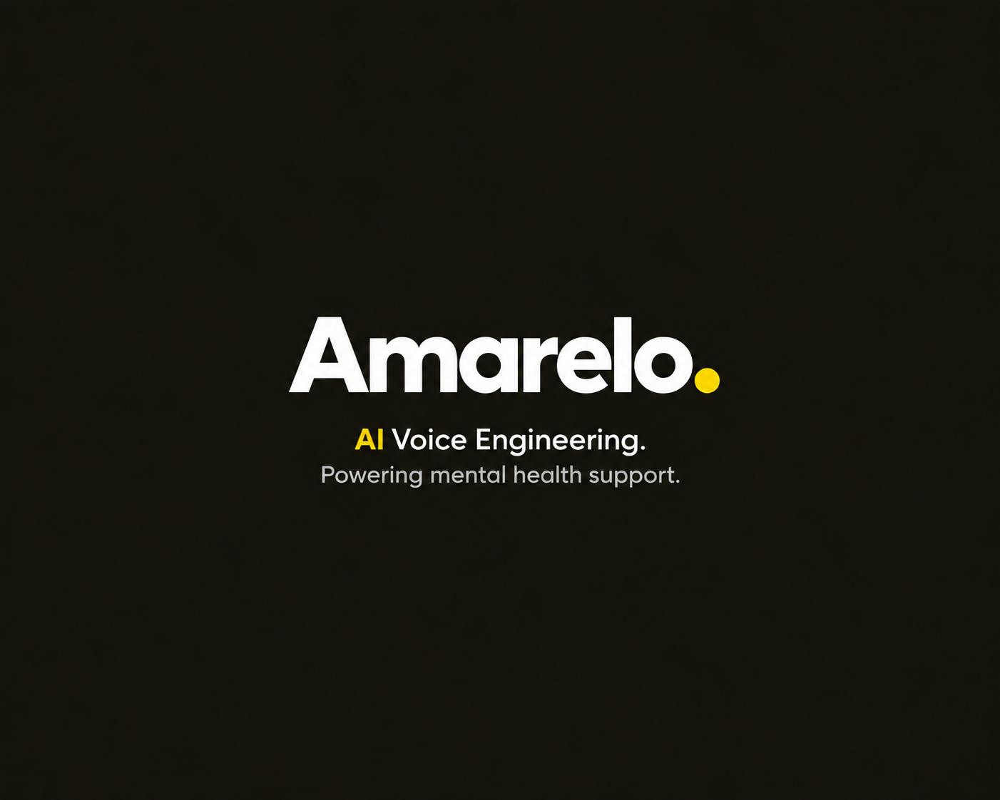
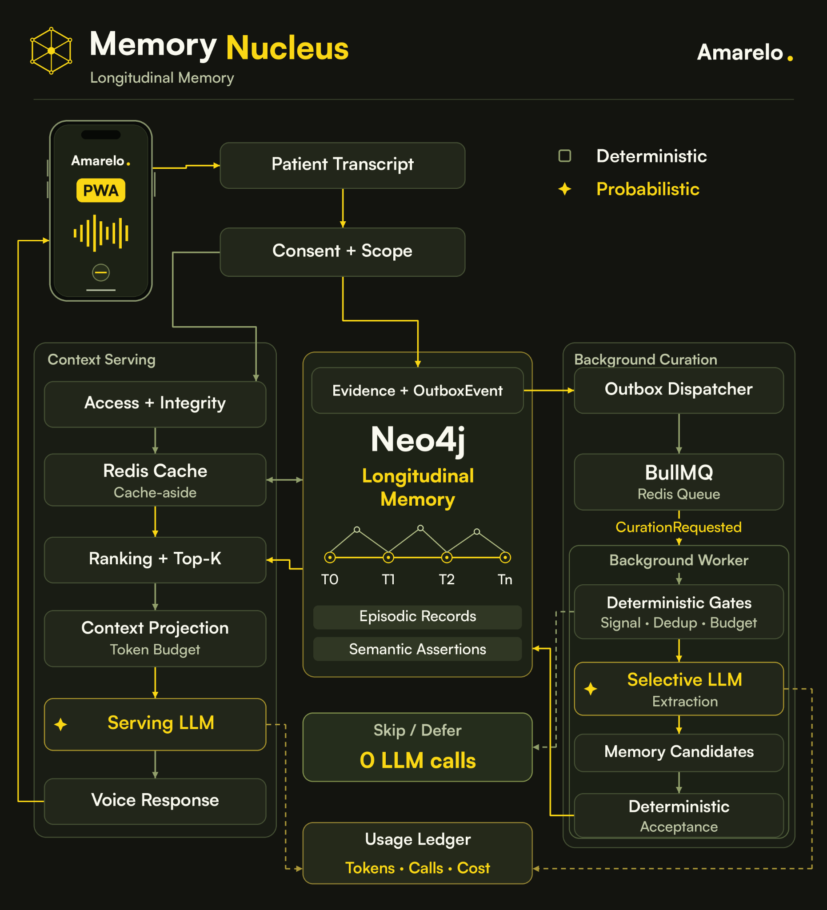

<p align="center">
  
</p>

<p align="center">
  <strong>AI for human connection in mental health.</strong>
</p>

<p align="center">
  <a href="https://amarelo.life">Website</a> ·
  <a href="#the-product">The product</a> ·
  <a href="#memory-nucleus">Memory Nucleus</a> ·
  <a href="#build-locally">Build locally</a>
</p>

## The product

Amarelo is a voice-first mental health support product being built around **continuity, personal memory and human connection**. It is designed to help people talk through everyday experiences, keep useful context over time and decide what to share with the people who support them.

A difficult week, a change in routine or something that helped yesterday can matter again tomorrow. Amarelo's goal is to make that context available when it is useful, without asking someone to retell their whole story at every conversation.

The person stays at the center. AI helps organize and contextualize; the human support network remains essential.

> **In development.** The repository includes a PWA, authenticated conversation experiments and an internal Memory integration. The complete voice-and-memory experience is still being developed and validated. See [current status](#current-status).

### A voice, a memory, a connection

The intended experience brings three things together:

| Experience | What it means for the person |
| --- | --- |
| **Talk naturally** | An installable PWA centered on voice, with a visible listening/speaking presence, readable captions and accessible controls. |
| **Carry context forward** | Relevant experiences and preferences can inform later conversations, with their source and uncertainty preserved. |
| **Choose what to share** | A memory review surface and explicit permissions are designed to help someone communicate with trusted people on their own terms. |

Amarelo calls its AI companions **Elos**—Portuguese for links. Ana is the first implemented agent; Ana, Nico and Isa appear in the product experience. Choosing an Elo is a personal preference and does not identify a diagnosis or grant anyone access to a conversation.

### Human support, with the person in control

The product is designed for adults seeking support in everyday life, their trusted support network and qualified professionals when the person chooses to involve them. Each participant has a private account. Being a relative, supporter or professional does not automatically confer access to another person's information.

The product contract calls for inspectable, limited and revocable sharing, with a distinction between what someone said and what a model inferred. Review, correction and sharing workflows are part of that direction; their interfaces and backend capabilities are at different stages of implementation.

Amarelo is not therapy, diagnosis, treatment or a crisis service, and does not replace qualified care. Read the [product and privacy boundaries](./.agents/rules/008-product-safety-and-privacy.rule.md).

## Memory Nucleus

**Memory Nucleus is the continuity layer behind Amarelo.** It separates conversation evidence from accepted memory, then selects useful context for a later interaction.

Longitudinal memory means understanding records **across time**. An episodic record describes an experience; a semantic assertion captures a fact or preference with its provenance and validity. The longitudinal view connects those records over time, rather than treating the latest conversation as a complete or permanent picture of a person.

For example, a person might say that evening walks helped during one week and later describe a different routine. A useful memory system preserves that chronology and context. It should not turn a past observation into an unconditional fact about the person.

<p align="center">
  <a href="./assets/images/memory-nucleus-diagram.png">
    
  </a>
</p>

*Architecture overview, including the intended voice loop and selected cache layer. The current internal integration is text-based; the full voice bridge, serving-cache integration and end-to-end validation remain separate work.*

### How continuity becomes context

1. **Capture evidence within scope.** The internal text integration captures the authenticated person's current message. A transcript is evidence; an assistant's response does not become evidence about the person.
2. **Curate in the background.** Neo4j commits protected changes and an outbox event together. A dispatcher publishes reference-only jobs to BullMQ on a dedicated Redis Queue service. Delivery is at least once, so processing is idempotent and protected effects recheck current authority.
3. **Let models propose; let policy decide.** Signal, duplicate and budget checks can skip or defer extraction. When extraction runs, the model produces candidates. Deterministic acceptance rules control which candidates become canonical memory.
4. **Retrieve eligible records.** Permission, provenance, lifecycle and integrity checks come before ranking. Conflicting eligible records preserve uncertainty; similarity alone cannot turn an ineligible record into context.
5. **Project a bounded context.** Relevant records are selected within a hard token budget. Conversation owns final context assembly, so a longer personal history does not require sending the entire history to the model.

### Spend reasoning where it helps

The engineering thesis is **memory → context → quality → cost**: keep useful continuity while limiting repeated history and unnecessary inference.

Normal structured/full-text memory retrieval uses no LLM. Background work can also finish with zero model calls when deterministic gates skip or defer it. The diagram's **“0 LLM calls”** refers to that skipped work; generating a conversation response still requires its own model work.

Serving and curation attempts feed a usage ledger. Missing usage or cost stays unknown. These mechanisms are implemented in source, but measured savings, voice costs and quality improvements remain to be validated.

<details>
<summary><strong>Explore the architecture</strong></summary>

| Boundary | Responsibility |
| --- | --- |
| [Mobile PWA](./workspaces/apps/mobile/readme.md) | The person's conversation surface, captions and voice presence, using [Orbz](https://github.com/NeonGate-AI/orbz). |
| [Chatterbox](./workspaces/microservices/chatterbox/readme.md) | Fastify transport, WorkOS authentication and server-side provider composition. |
| [Conversation](./.agents/context/workspaces/ai/conversation.md) | Framework-neutral interaction, cognitive routing and final context assembly for Ana. |
| [Memory SDK](./workspaces/packages/memory-sdk/readme.md) | The approved public boundary through which AI consumes personal memory. |
| [Memory Nucleus](./.agents/context/workspaces/memory-nucleus/overview.md) | Memory formation, lifecycle, retrieval, projection and economics; Neo4j is its canonical graph. |
| [Runtime](./workspaces/packages/runtime/readme.md) | Local Kubernetes profiles, including Neo4j, persistent Redis Queue, a physically separate disposable Redis Cache and object storage. |

Memory Nucleus is one workspace with dependency direction **Infrastructure → Application → Domain**. General knowledge retrieval belongs to [Knowledge](./.agents/context/workspaces/ai/knowledge.md); personal memory has its own governed boundary. Queues, caches and indexes do not become independent sources of memory truth.

See the [architecture overview](./.agents/context/architecture/overview.md), [memory taxonomy](./.agents/adrs/0007-memory-taxonomy-and-longitudinal-projections.adr.md) and [integrated delivery record](./.agents/context/workspaces/memory-nucleus/integrated-delivery.md) for the detailed contracts and evidence limits.

</details>

## Current status

| Area | What is in this repository |
| --- | --- |
| **Product surfaces** | Public landing page, onboarding, an installable PWA and a memory console. The default voice interface and console use synthetic data. |
| **Conversation** | Authenticated development text with Ana, plus an opt-in Realtime WebRTC experiment. These are bounded development paths. |
| **Memory** | Neo4j integration, background curation, shadow comparisons, an internal canary and economics reporting are integrated in source. Memory flags default to off. |
| **Next proof point** | Validate the integrated text-and-memory path, then complete the voice lifecycle and the guardrails needed before external exposure. |

The latest Memory delivery prioritized source integration and explicitly deferred validation. It is not evidence of a working deployment, measured ROI or production readiness. [SPEC-049](./.agents/specs/049-integrated-memory-validation-debt.spec.md) tracks that validation debt; the [spec catalog](./.agents/specs/readme.md) records the delivery sequence.

## Build locally

Use **Node.js 24**, **pnpm 10.32.1** and a POSIX shell.

```sh
git clone https://github.com/NeonGate-AI/amarelo.git
cd amarelo
pnpm install --frozen-lockfile
./cli/elo doctor
pnpm dev
```

`pnpm dev` starts the four interface applications: landing, console, onboarding and mobile. Open the PWA at `http://localhost:3003` to explore its default synthetic voice interface.

For an authenticated conversation with Ana, follow the [local conversation setup](./workspaces/apps/mobile/readme.md#run-the-authenticated-text-slice), configure the owning `.env.template` files and run `pnpm dev:text`. WorkOS and model credentials stay server-side. This development setup is separate from enabling Memory and its background worker.

For the local infrastructure profiles, use the [runtime guide](./workspaces/packages/runtime/readme.md). The [Elo CLI guide](./cli/readme.md) covers environment setup, diagnostics and repository checks.

## Contributing

Amarelo uses spec-driven development: product contracts, architecture decisions and delivery evidence live alongside the code. Start with [AGENTS.md](./AGENTS.md) and the [delivery workflow](./.agents/specs/workflow.md). Ordinary work branches from and opens pull requests into `staging`; `main` receives reviewed promotions from `staging`.

Useful entry points: [product context](./.agents/context/product/overview.md) · [spec catalog](./.agents/specs/readme.md) · [Elo CLI](./cli/readme.md) · [GitHub issues](https://github.com/NeonGate-AI/amarelo/issues).
